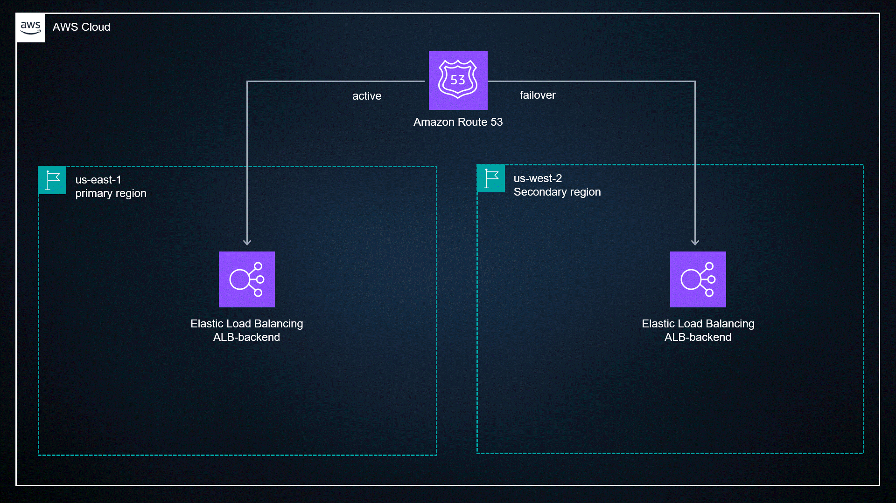

This diagram shows a Highly Available 3-Tier AWS Architecture with Disaster Recovery (Warm Standby Strategy).
It is a production-grade architecture used in real companies to ensure:

High availability

Scalability

Security

Disaster recovery

Fault tolerance

I'll explain it layer by layer and service by service so you can explain it in interviews easily. 🚀

1. User Entry Layer (DNS + CDN + Security)
Client → Route 53 → CloudFront → WAF
4
1️⃣ Amazon Route 53

Amazon Route 53 is AWS DNS service.

Responsibilities:

Converts domain name → IP address

Health checks

Failover routing

In this architecture:

Primary Region → us-east-1

Secondary Region → us-west-2

If the primary fails → Route53 automatically fails over to secondary region.

Example:

client → example.com → route53 → primary region

If primary fails:

route53 → secondary region
2️⃣ AWS WAF

AWS Web Application Firewall

Purpose:
Protect the application from attacks like:

SQL injection

XSS

bot traffic

brute force

Example:

Client Request
     ↓
WAF filters malicious traffic
     ↓
Allowed traffic goes to CloudFront
3️⃣ Amazon CloudFront

CloudFront is a Content Delivery Network (CDN).

Purpose:

cache static files

reduce latency

improve performance

Examples cached:

images

CSS

JS

videos

Flow:

Client → CloudFront → ALB → EC2
2. Region-Level Architecture

The system runs in two AWS regions.

Primary Region

us-east-1

Disaster Recovery Region

us-west-2

DR Strategy used here:

⭐ Warm Standby

Meaning:

Secondary region is running but scaled down

If failure happens → scale up quickly

3. VPC (Virtual Private Cloud)
4
Amazon VPC

VPC is a private network inside AWS.

Inside the VPC:

Public Subnet
Web Subnet
App Subnet
DB Subnet

Each tier is isolated for security.

4. Public Subnet Components
Bastion Host (EC2)

Purpose:
Secure SSH access.

Instead of allowing SSH to all servers:

Admin → Bastion Host → Private Servers

This improves security.

NAT Gateway

Used for private servers to access internet.

Example:

Private EC2 → NAT Gateway → Internet

Use cases:

downloading updates

pulling packages

docker images

Private instances cannot be accessed from internet.

5. Load Balancing Layer
Elastic Load Balancer (ALB)

ALB distributes incoming traffic.

Example:

Client
  ↓
ALB
 ↓    ↓
EC2    EC2

Benefits:

high availability

health checks

load distribution

6. Web Tier
EC2 Web Servers

Located in Web Subnet

Responsibilities:

serve frontend

handle HTTP requests

Example tech:

Nginx

Apache

Node.js

React backend

Auto Scaling Group (ASG)

Automatically scales EC2 instances.

Example:

Traffic ↑
Auto Scaling → add instances

Example:

Traffic	Instances
low	2
medium	5
high	10
7. Application Tier
EC2 Application Servers

Located in App Subnet.

Responsibilities:

business logic

API processing

backend services

Example technologies:

Java Spring Boot

Python Django

Node.js

Microservices

8. Database Tier
Amazon RDS

Managed relational database service.

Examples:

MySQL

PostgreSQL

MariaDB

Oracle

In this architecture:

Primary DB
Secondary DB

This is Multi-AZ database replication.

Benefits:

high availability

automatic failover

data redundancy

9. Cross Region Replication

Database replication between regions.

Primary Region DB
        ↓
Cross-region replication
        ↓
Secondary Region DB

Used for disaster recovery.

10. AWS Backup

AWS Backup is used for automated backups.

Backups stored in:

Backup Vault

Supports:

EC2

RDS

EBS

DynamoDB

EFS

Cross-region backup:

Primary region backup
        ↓
Secondary region vault
11. Availability Zones

Each region has multiple AZs.

Example:

us-east-1a
us-east-1b

Architecture spreads resources across AZs.

Benefits:

high availability

fault tolerance

If one AZ fails → system still runs.

12. Disaster Recovery Strategy

This architecture uses:

⭐ Warm Standby

Meaning:

Primary region → full capacity
Secondary region → minimal running capacity

If primary fails:

Route53 detects failure

Traffic redirected

Secondary region scales up

Complete Request Flow

User request travels like this:

Client
   ↓
Route53
   ↓
AWS WAF
   ↓
CloudFront
   ↓
Application Load Balancer
   ↓
Web EC2 instances
   ↓
App EC2 instances
   ↓
RDS database
Why This Architecture is Used

Benefits:

High Availability

Multi AZ deployment

Disaster Recovery

Cross region failover

Security

WAF + private subnets

Scalability

Auto Scaling

Performance

CloudFront CDN

Reliability

RDS replication

How to Explain This in Interview (Short Version)

You can say:

This is a highly available three-tier architecture deployed across multiple availability zones and two regions. Route53 handles DNS and failover routing. CloudFront improves performance and WAF protects against web attacks. Traffic goes through an Application Load Balancer to web servers running in an Auto Scaling group. The web tier communicates with the application tier and the backend database is Amazon RDS with multi-AZ replication. AWS Backup provides cross-region backups and Route53 can failover to the secondary region in case of disaster.